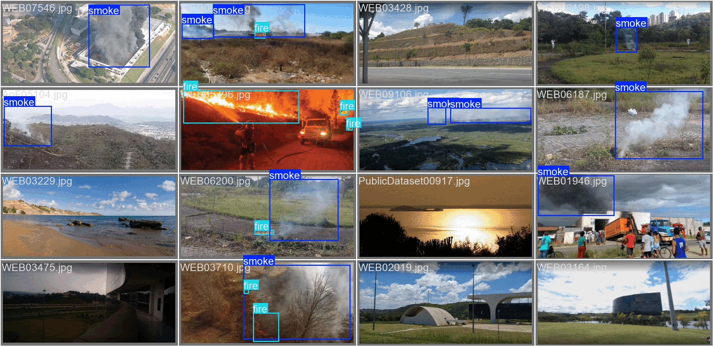
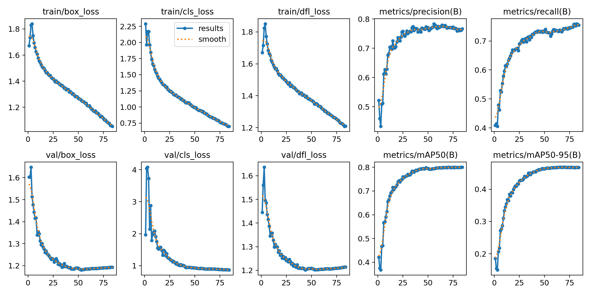
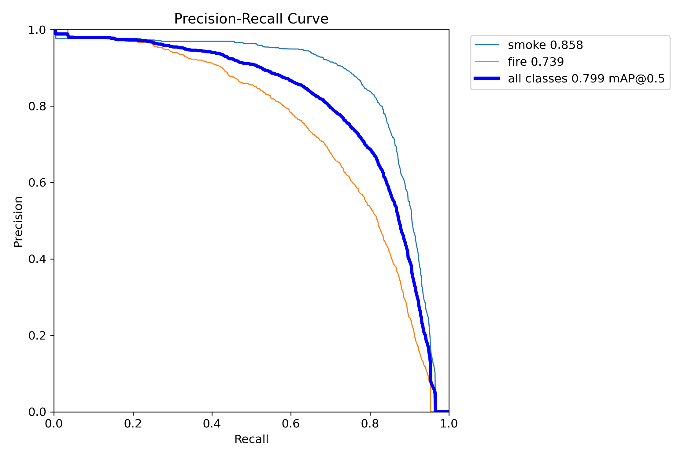
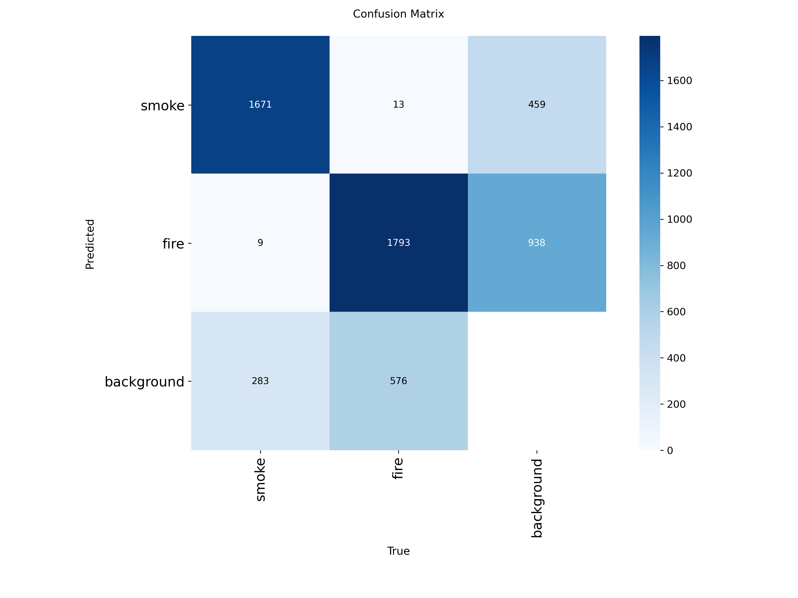

# Fire & Smoke Detection

Real-time fire and smoke detection in camera/CCTV imagery using YOLO11.
The project focuses on a recurring difficulty in this task: **separating real
fire/smoke from visual confusers** such as clouds, fog, sunset glare, warm
lighting, and red/industrial structures.



## What the model does

A YOLO11s object detector that draws bounding boxes for two classes — `fire`
and `smoke` — on still images or video frames. It was trained primarily on the
**D-Fire** dataset and then supplemented with additional images targeted at
reducing false positives (see [Datasets](#datasets)).

## Results

The project went through two training runs. The second run runned in YOLO11s,
trained longer with early stopping, used a higher input resolution, and added
hard-negative / confuser images to the data.

| Metric (mAP@0.5) | Baseline | Final (YOLO11s) |
|---|---|---|
| **all classes** | 0.747 | **0.799** |
| smoke | 0.813 | **0.858** |
| fire | 0.681 | **0.739** |

Final run, additional detail:

| Class | Precision | Recall | mAP@0.5 | mAP@0.5:0.95 |
|---|---|---|---|---|
| all | 0.777 | 0.735 | 0.799 | 0.468 |
| smoke | 0.839 | 0.799 | 0.858 | 0.536 |
| fire | 0.715 | 0.671 | 0.739 | 0.400 |

Training configuration: YOLO11s, `imgsz=960`, `batch=8`, `epochs=100`,
`patience=20`. Best results at epoch 64; training stopped early at epoch 84.
Trained on a single RTX 4070 Laptop GPU (8 GB), ~10.4 hours.

### Curves and diagnostics

| | |
|---|---|
|  | Training/validation losses and metrics over epochs |
|  | Precision–Recall curve |
|  | Confusion matrix |

**What improved:** longer, properly-completed training (the baseline was cut
short) plus the model upgrade and higher resolution lifted overall mAP by ~5
points, with the weaker `fire` class gaining the most.

**Optimal confidence threshold:** the F1 curve peaks at **conf ≈ 0.36**, which
is the value used in the demo.

## Datasets

The training set is built primarily on **D-Fire**, then supplemented with
partial samples from several other datasets to address specific weaknesses
(cloud/smoke confusion, fire-vs-not-fire, background false positives). Only
D-Fire was used in full; the others were added in part.

| Dataset | Role in this project |
|---|---|
| [D-Fire](https://github.com/gaiasd/DFireDataset) | Main dataset (fire & smoke) |  
| [HPWREN / AI For Mankind](https://github.com/aiformankind/wildfire-smoke-dataset) | Cloud vs. smoke distinction |  
| [BoWFire](https://www.kaggle.com/datasets/malligasenthil/bowfire) | Negative samples (fire / not-fire) |  
| [DetectiumFire](https://www.kaggle.com/datasets/yimengfuyao/detectiumfire) | Background / confuser samples |  


## Demo

A simple Gradio app lets you upload an image and see detections.

```bash
python app/app.py
```

Live demo: https://huggingface.co/spaces/oralyalcinpinar/fire-detection

## Installation & usage

```bash
git clone https://github.com/Oralmanke/fire-detection
cd fire-detection
pip install -r requirements.txt
```

Run inference on an image:

```bash
yolo detect predict model=weights/best.pt source=path/to/image.jpg conf=0.36
```

Export optimized models:

```bash
python src/export.py        # produces ONNX and TensorRT engine
```

## Model weights

- `best.pt` — trained PyTorch weights
- `best.onnx` — portable, runs anywhere with ONNX Runtime
- `best.engine` — TensorRT FP16, **built for and only valid on the same GPU/driver**

## Known limitations & future work

This is an early-stage model. Honest current weaknesses:

- **Background false positives.** The model still predicts `fire`/`smoke` on
  some confuser backgrounds (clouds, glare, industrial scenes). Adding more
  hard negatives to improve performance of the model.
- **`fire` lags `smoke`.** Fire is smaller and more visually varied; it needs
  more and more diverse examples (night, distant, small flames).


## Project structure

```
fire-detection/
├── app/            # demo (Gradio)
├── notebooks/      # data exploration
├── src/            # train.py, test.py, export.py
├── docs/           # README images, demo gif
├── data.yaml
├── requirements.txt
└── weights/        # best.pt / best.onnx / best.engine
```

## License

MIT — see [LICENSE](LICENSE).

## References

<a name="ref1"></a>[1] Venâncio et al. "An automatic fire detection system..." *Neural Computing and Applications*, 2022.

<a name="ref2"></a>[2] AI For Mankind & HPWREN. Wildfire Smoke Dataset. CC BY-NC-SA 4.0. https://github.com/aiformankind/wildfire-smoke-dataset

<a name="ref3"></a>[3] Chino et al. "BoWFire: Detection of Fire in Still Images..." *SIBGRAPI*, 2015. https://arxiv.org/abs/1506.03495

<a name="ref4"></a>[4] Liu et al. "DetectiumFire: A Comprehensive Multi-modal Dataset..." *NeurIPS 2025*. https://arxiv.org/abs/2511.02495